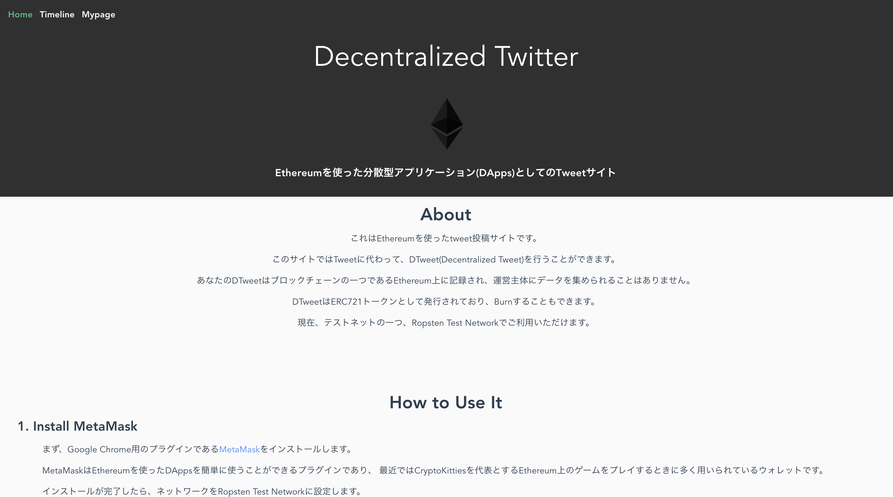

# Decentralized Twitter



[Decentralized Twitter](https://dtwitter.herokuapp.com/)

## Requirements
- Vue.js 2.5.13
- solidity 0.4.18
- Truffle 4.0.4
- zeppelin-solidity 1.8.0
- MetaMask

## Set up
```
# set repository
git clone git@github.com:shiki-tak/Decentralized_Twitter.git
cd Decentralized_Twitter  
yarn

# deploy contract
truffle compile  
truffle migrate --network ropsten  

# execute
yarn serve
```
## Next step
- DTweet Auction
 - DTweet Sell
 - DTweet Buy


- DTweet favorite button

...etc
